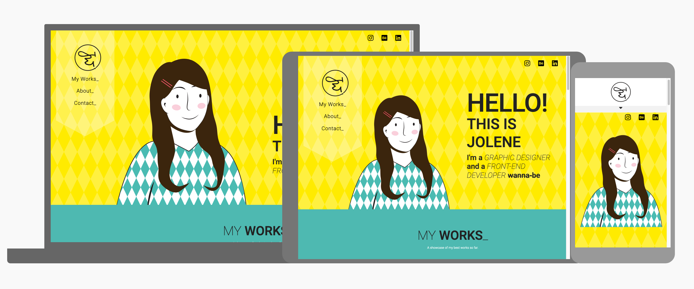

# Context

A portfolio website is essential for designers to have a portfolio site to showcase their works, to provide the convenience for the employers or whoever is looking for a freelance designer. This is a website created for myself, who was a graphic designer to showcase my abilities in visual desigining. 

The demo of the live website can be accessed here:

https://jolenewai.github.io/Designer-Portfolio-Site/ 

# UX/UI 

## Information Structure / Flow

This is a one page website. Informations are organised in sections and flow down through the page, with the sequence as follows:
- Home
- My Works
- About
- Contact

### Home
The page starts with a greeting and short introduction with an illustration as a symbol of myself

### My Works
This is a section where user can see my design works, with description of each artwork about

### About
A more in-depth introduction on my skills set, software knowledge and education background

### Contact
A contact form to enable user to drop me a message in case they need a collaboration

Information is structured in this way to cater to the audience needs. Usually for a designer, people would like to see their works before seeing their biography. After finding out more about this person, then they will decide whether to contact or not.

## Target Audience
* Employers
* Companies/Employer who are looking for freelance designers
* Designers who are looking for collaborations on projects

## Navigation

The navigation is designed possible in two ways, first is through conventional scroll down, and another way is through direct clicking the nav bar. As this is a long page full of contents, to ease the navigation of each section, the navigation bar is fixed on the left side of the page (for desktop version), and expandable on top  (for mobile version). While user choose to navigate the page though the conventional way of scrolling down, the nav bar will show the section that the user is current in. 

## Colours

Bright and vibrant colours are selected in this design to capture audience attention.


This set of colours are selected based on the following characteristic:

__Primary Colours__

 **Yellow** - positive energy and creativity

 **Black** - Elegance and Formality

__Secondary Colours__

 **Muted Pink** - Passionate  

 **Turquoise Green** - Balance and harmony

 **Orange** - Vibrant, creativity

## Layout

__Typography__

* This layout uses heavy typography to replace the usual text in paragraphs
* Various text sizes and font styles are used to highlight and present the hierarchy of importance to reader\'s pleasure

__Grid__

* Using bootstraps grid layout as base, irregular grid layout is created

__Negative Space__

* Plenty of negative space are used so that users can focus on the content

__Call for Action__

* A contact form is created for contact purposes. On submit, the form will send an email to me with the form contents
*This form is a dummy form created for demo purposes only*

## Technology

* Bootstrap version 4.4</a>
* HTML 
* CSS
* Javascript

## Plugins

The animation on the website are created using the following plugin created by [michalsnik](https://github.com/michalsnik/aos)

* Animate on Scroll [AOS] (https://michalsnik.github.io/aos/)

## Reference / Credits

### Collapsable Nav Bar on Mobile Version

```
$(document).ready(function(){
    $('#sidebarCollapse').click(function(){
        // alert('hi')
        $('#nav-bar').toggleClass('active')
        $('#sidebarCollapse i').toggleClass('fa-rotate-180')
    })

})
```

* The codes for expandable navigation bar functionality above had made reference to the following tutorial:
[Bootstrap Sidebar](https://bootstrapious.com/p/bootstrap-sidebar)
* [Bootstap Documentation](https://getbootstrap.com)
* [W3 School](https://www.w3schools.com/)
* [CSS Clip Path Maker](https://bennettfeely.com/clippy/)
* [Google Material.io Resizer](https://material.io/resources/resizer/)


## Unsolved Bugs

* On mobile version, when navigating through clicking on the nav bar, the top part of each section will be covered by the nav bar due to the fixed position 

--------

